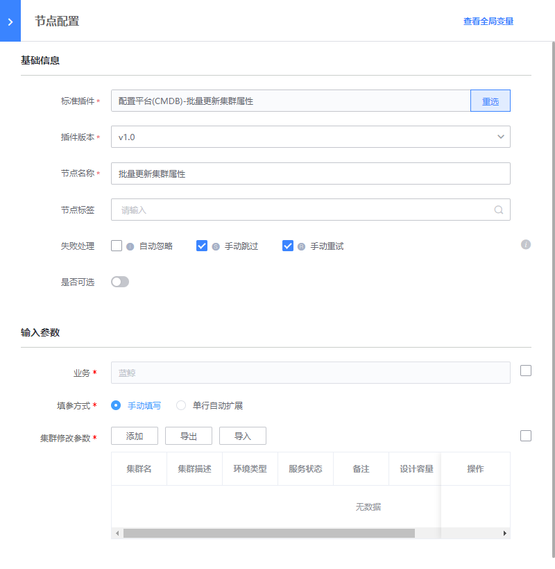

# 删除集群
> 版本`v1.0`

## 介绍

批量修改集群属性（支持进行单行扩展）

## 标签
`cc` `cmdb` `batch_update_set` 

## 参数说明

* `cc_set_select_method` 选择集群的方式
    * `manual`: 手动填写
    * `auto`: 单行自动扩展

* `cc_set_update_data` 集群属性修改数据

* `cc_set_template_break_line` 集群修改参数(可选)

## 输出参数说明

* 执行结果：

  系统展示的插件执行结果

## 样例

## 注意事项

* `cc_set_select_topo` 字段只在`cc_set_select_method`为`topo`时有效

* `cc_set_select_text` 字段只在`cc_set_select_method`为`text`时有效
  

  