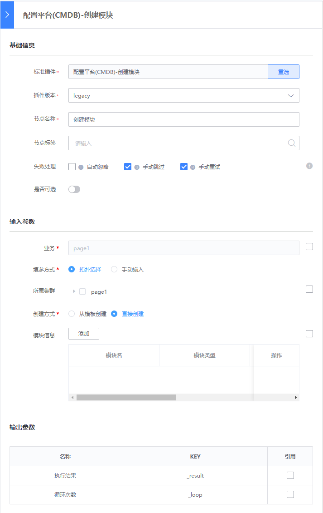
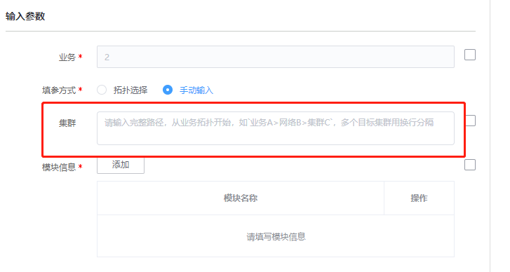
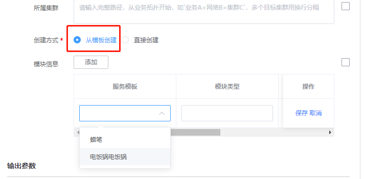
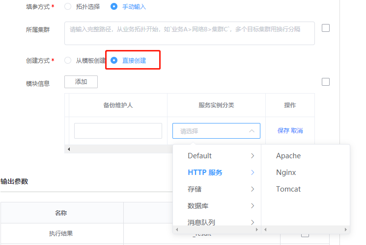

# 创建模块
> 版本`legacy`

## 介绍

创建模块

## 标签
`cc` `cmdb` `create_module` 

## 参数说明

* `biz_cc_id` 业务id

* `cc_set_select_method` 选择集群的方式
    * `text`: 文本输入
    * `topo`: 树形组件上勾选

* `cc_set_select_topo` 树形组件勾选的集群列表
   * 列表元素结构：`{bz_inst_name}_{bz_inst_id}`

* `cc_set_select_text` 文本输入的集群路径集合
    * 换行区分路径，`>`区分层级
    * example: `a>b>c\n   a>b`
    * 已容错：冗余回车/空格
    
* `cc_create_method` 创建方式
    * `category` 直接创建（按服务分类创建）
    * `template` 通过服务模板创建

* `cc_module_infos_category` 模块信息列表-直接创建（通过服务分类创建）(对象列表)
    * 必须参数：`bk_module_name` 模块名称

* `cc_module_infos_template` 模块信息列表-按服务模板创建(对象列表)
    * 必须参数：`cc_service_templates` 模板名称_模板id

## 输出参数说明

* 执行结果：

  系统展示的插件执行结果

## 样例

切换为手动输入

通过服务模板创建集群

通过服务分类创建

## 注意事项

* `cc_set_select_topo` 字段只在`cc_set_select_method`为`topo`时有效

* `cc_set_select_text` 字段只在`cc_set_select_method`为`text`时有效
  
* 通过服务模板创建时，模块名称`bk_module_id`与服务模板名称`service_template_name`保持一致，无需填写