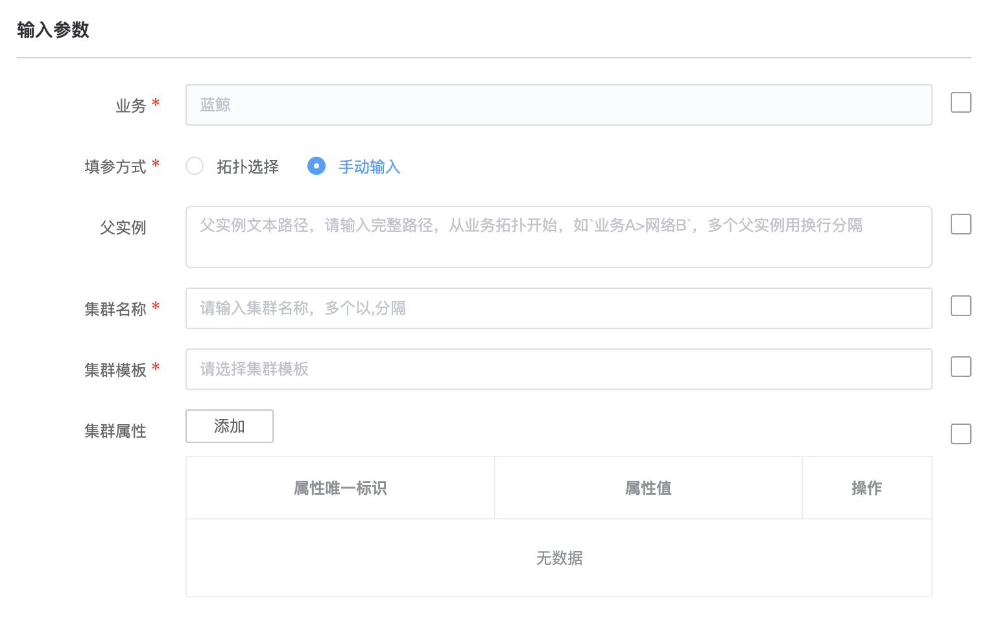
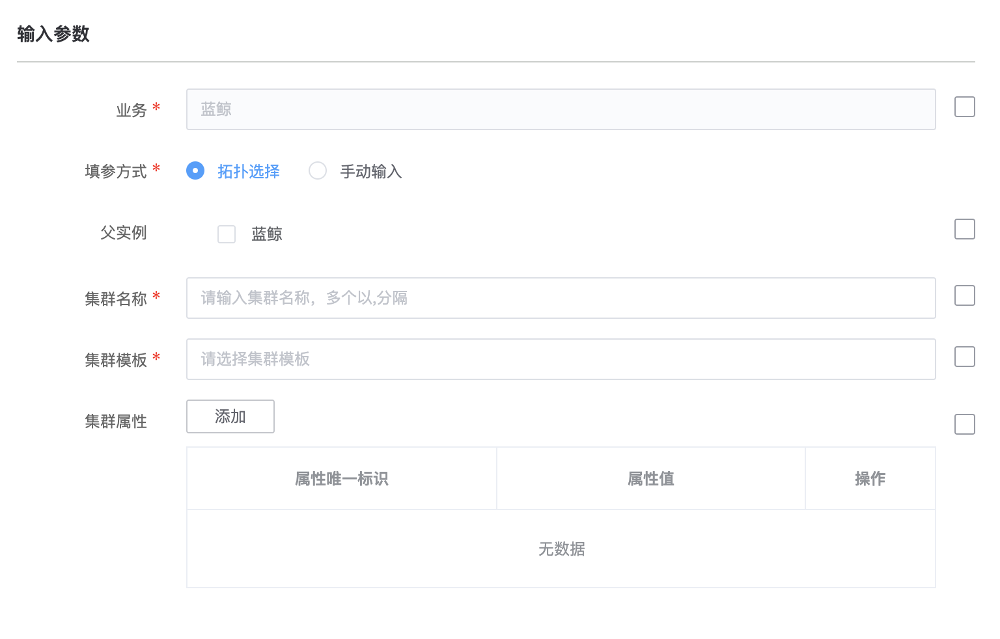

# 根据模板创建集群
> 版本 `v1.0`

## 介绍

在用户选择的父实例下根据选择的模板创建集群

## 标签
`cc` `cmdb` `create_set` 

## 参数说明

* `业务` 业务名称

* `填参方式` 选择父实例的方式
    * `手动输入`: 文本输入
            * `父实例` 文本输入的父实例路径集合
            * 换行区分路径，`>`区分层级
            * example: `a>b>c\n   a>b`
            * 已容错：冗余回车/空格
    * `拓扑选择`: 树形组件上勾选

* `集群名称` 集群名称
* `集群模板` 选择集群模板

## 输出参数说明

* 执行结果：

  系统展示的插件执行结果

## 样例

#### 手动输入

#### 拓扑选择

## 注意事项

点击集群模板选择框时没有数据是该业务下没有集群模板
  

  