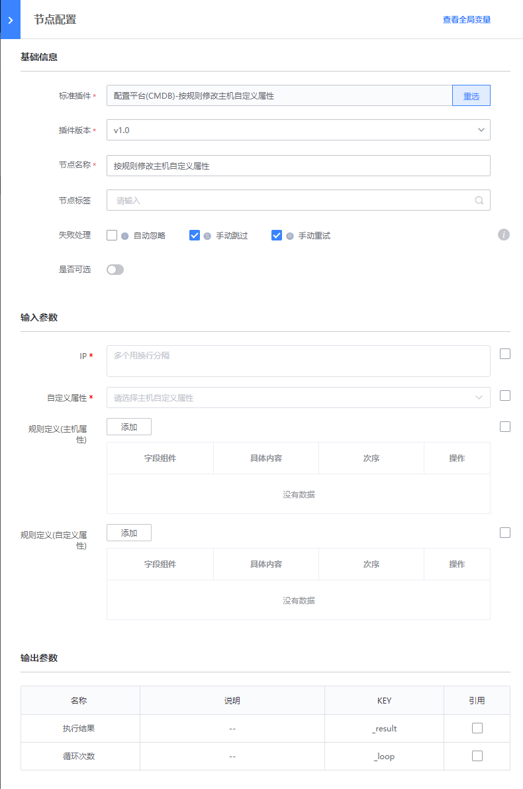

# 按规则修改主机自定义属性
> 版本`v1.0`

## 介绍

按规则修改主机自定义属性

## 标签
`cc` `cmdb` `host_custom_property_change`

## 参数说明
- IP：需要进行任务的主机IP
- 自定义属性： 需要进行修改的主机自定义属性
- 规则定义(主机属性)
    - 字段组件分为三种： `主机属性`，`set属性`， `模块属性`
    - 具体内容： 从CMDB拉取
    - 次序： 按顺序赋值
- 规则定义(自定义属性)
    - 字段组件分为三种： `ip(.需替换成)`， `自增变量`， `自定义字符(串)`
    - 具体内容： 用户填写
    - 次序： 按顺序赋值

## 输出参数说明

* 执行结果：

  系统展示的插件执行结果
  用户输入的经过CMDB判断不合法的IP

## 样例

