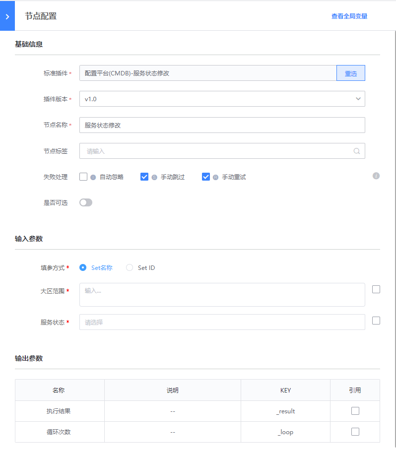

# 删除集群
> 版本 `v1.1`

## 介绍

修改集群服务状态

## 标签
`cc` `cmdb` `update_world_status` 

## 参数说明

* `set_select_method` 传参形式

* `set_attr_id` 集群属性ID，集群范围中填写的值会在此处填写的属性 ID 的值上进行过滤

* `set_list` 集群范围 多个参数用英文","分隔
    * `name`: Set名称
    * `id`: Set ID

* `set_status` 实时获取的服务状态

## 输出参数说明

* 执行结果：

  系统展示的插件执行结果

## 样例

