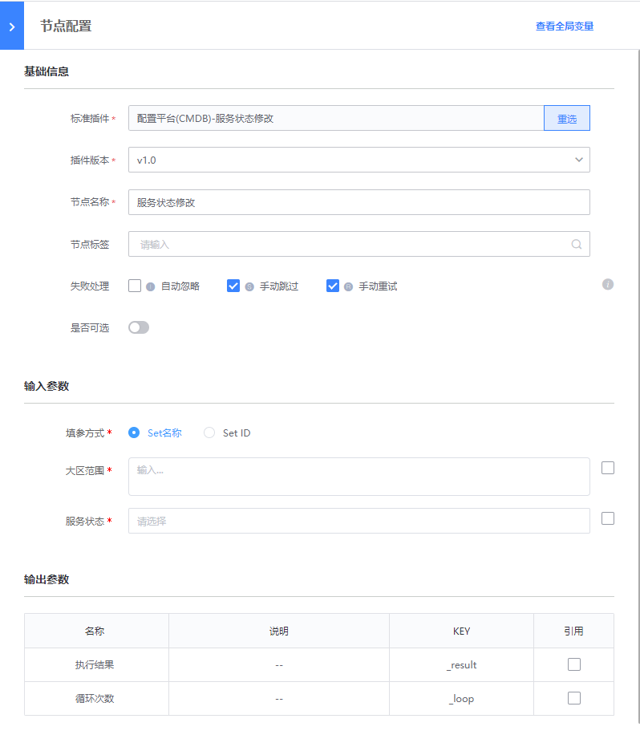

# 删除集群
> 版本 `v1.0`

## 介绍

修改集群服务状态

## 标签
`cc` `cmdb` `update_world_status` 

## 参数说明

* `set_select_method` 传参形式

* `大区范围` 大区范围 多个参数用英文","分隔
    * `name`: Set名称
    * `id`: Set ID

* `服务状态` 实时获取的服务状态

## 输出参数说明

* 执行结果：

  系统展示的插件执行结果

## 样例

