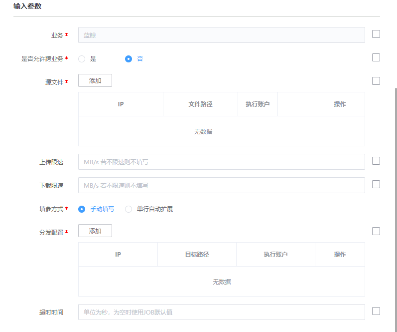

# 作业平台(JOB)-快速执行脚本

### 介绍

快速执行脚本

### 标签

`job` `execute` `task`

### 参数说明

#### 输入参数说明

- 业务ID: 当前操作所属的 CMDB 业务 ID

- 是否允许跨业务:
    是或否

- 源文件：
    - IP：跨业务用【管控区域ID:IP】
    - 文件路径： 文件的绝对路径
    - 执行账户： 执行操作的账户
   
- 上传限速：
    单位MB/s 

- 下载限速：
    单位MB/s
    
- 填参方式：
    手动填写（manual）或 单行自动扩展（auto）

- 分发配置：
    - IP：跨业务用【管控区域ID:IP】
    - 目标路径： 文件的绝对路径
    - 执行账户： 执行操作的账户

- 自动扩展分隔符：
    可为空，单行自动扩展模式下每一行的换行符，默认使用 ","

- 超时时间：
    单位为秒，为空时使用JOB默认值
    
#### 输出参数说明

- 执行结果：

  JOB任务ID  提交的任务在 JOB 平台的实例 ID
  JOB任务链接  提交的任务在 JOB 平台的 URL

### 样例

### 注意事项
