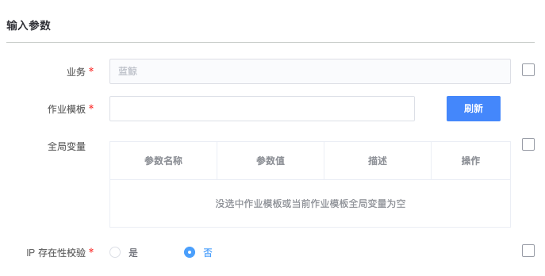

# 作业平台(JOB)-执行作业

### 介绍

执行作业

### 标签

`job` `execute` `task`

### 参数说明

#### 输入参数说明

- 业务ID: 当前操作所属的 CMDB 业务 ID

- 作业模板 ID: 需要执行的 JOB 作业模板 ID

- 全局变量：

  作业模板执行所需的全局变量列表
  - 变量类型: 云参(1) 上下文参数(2) IP(3)
  - 变量名: 
  - 变量值:

- IP 存在性校验:
    是否做 IP 存在性校验，如果ip校验开关打开，校验通过的ip数量若减少，即返回错误

#### 输出参数说明

- 执行结果：

  JOB全局变量 输出日志中提取的全局变量

### 样例

### 注意事项
