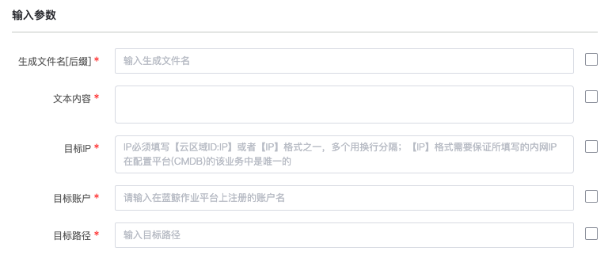

# 作业平台(JOB)-本地文本框内容上传

### 介绍

本地文本框内容上传

### 标签

`job` `execute` `upload`

### 参数说明

#### 输入参数说明

- 生成文件名[后缀]

- 文本内容

- 目标IP：
    IP必须填写【管控区域ID:IP】或者【IP】格式之一，多个用换行分隔；【IP】格式需要保证所填写的内网IP在配置平台(CMDB)的该业务中是唯一的

- 目标账户:
    请输入在蓝鲸作业平台上注册的账户名

- 目标路径

#### 输出参数说明

- 执行结果：

  JOB全局变量 输出日志中提取的全局变量

### 样例

### 注意事项
