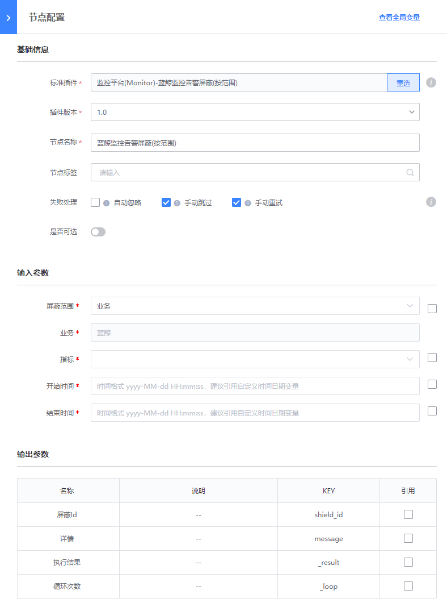
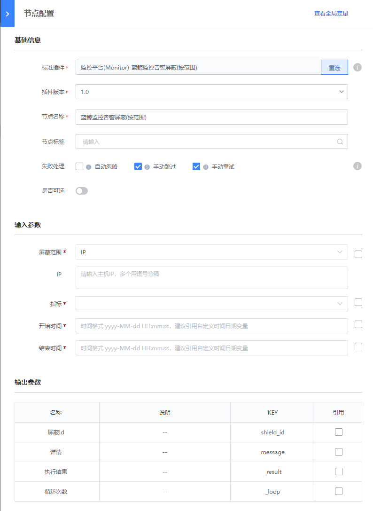
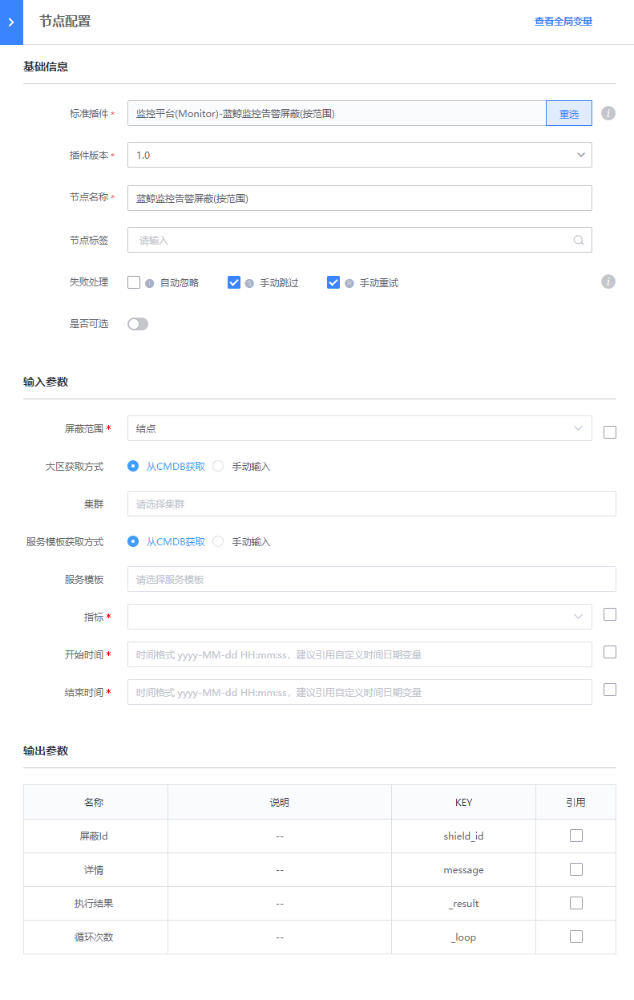
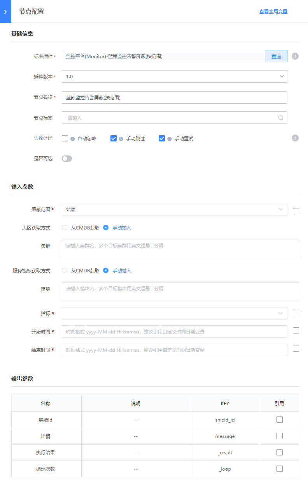

# 监控平台(Monitor) - 蓝鲸监控告警屏蔽(按范围)

### 介绍

蓝鲸监控告警屏蔽(按范围)

### 标签

`Monitor` `alarm_shield`

### 参数说明

#### 输入参数说明

- 屏蔽范围: 告警屏蔽范围（业务、IP、结点）
    
    - 业务
    - IP 多个用逗号分隔
    - 结点
        - 大区获取方式(从CMDB获取、手动输入)
        - 集群 集群名，多个用英文逗号 `,` 分隔开
        - 服务模板获取方式(从CMDB获取、手动输入)
        - 模块 模块名，多个用英文逗号 `,` 分隔开

- 指标： 屏蔽指标

- 时间选择： 手动输入、从当前时间开始，仅输入持续时间、‘输入开始时间和持续时间

- 开始时间： 时间格式 yyyy-MM-dd HH:mm:ss，建议引用自定义时间日期变量

- 结束时间：时间格式 yyyy-MM-dd HH:mm:ss，建议引用自定义时间日期变量

- 持续时间（分钟）： 填写屏蔽持续时间

#### 输出参数说明

- 屏蔽Id

- 详情

### 样例

- 屏蔽范围选择业务示例

- 屏蔽范围选择IP示例

- 屏蔽范围选择结点示例

    - 从CMDB拉取
    
        
        
    - 手动输入
    
        

### 注意事项
