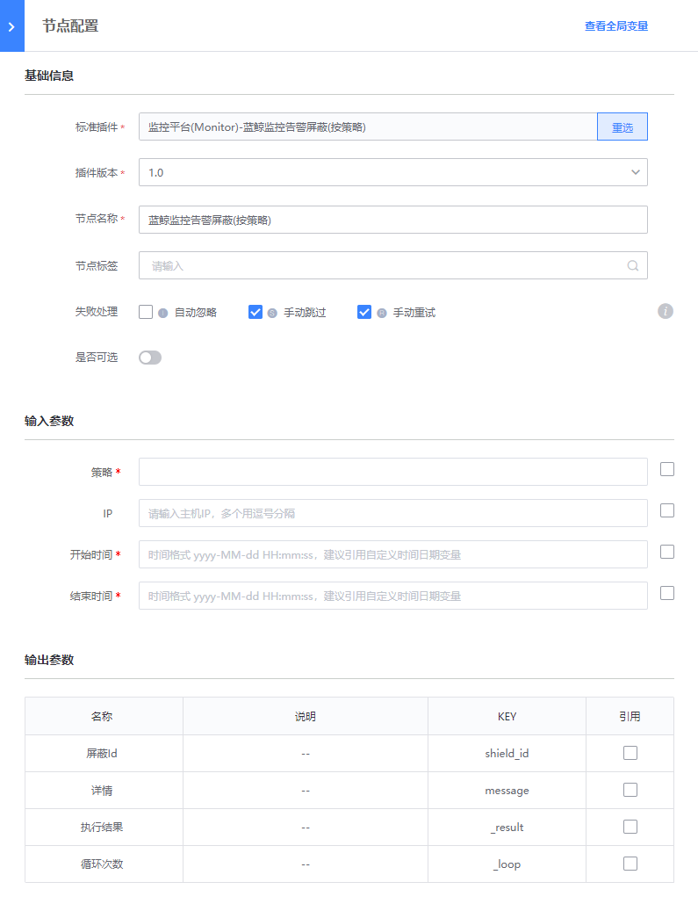

# 监控平台(Monitor) - 蓝鲸监控告警屏蔽(按策略)

### 介绍

蓝鲸监控告警屏蔽(按策略)

### 标签

`Monitor` `alarm_shield_strategy`

### 参数说明

#### 输入参数说明

- 策略： 屏蔽策略

- IP 多个用逗号分隔

- 时间选择： 手动输入、从当前时间开始，仅输入持续时间、‘输入开始时间和持续时间

- 开始时间： 时间格式 yyyy-MM-dd HH:mm:ss，建议引用自定义时间日期变量

- 结束时间：时间格式 yyyy-MM-dd HH:mm:ss，建议引用自定义时间日期变量

- 持续时间（分钟）： 填写屏蔽持续时间

#### 输出参数说明

- 屏蔽Id

- 详情

### 样例

### 注意事项