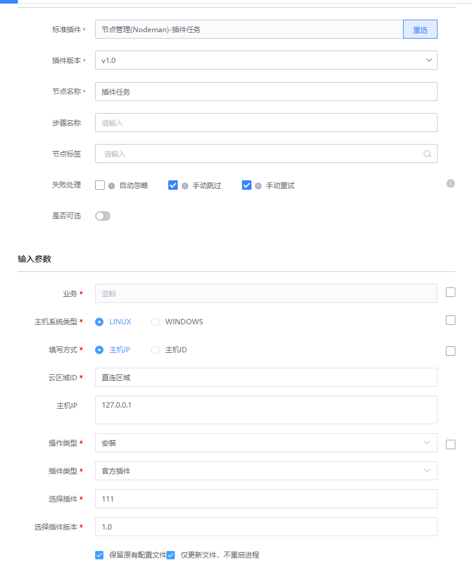

# Nodeman插件操作

### 介绍

该插件可以指定主机安装节点管理相关插件

### 标签

`nodeman` `plugin` `operate`

### 参数说明

#### 输入参数说明

- 业务: 业务ID

- 主机系统类型: 用于查询插件版本，可选LINUX和WINDOWS

- 填写方式：指定主机的填写方式，可选主机IP和主机ID
    - 主机IP:主机IP 多个用英文逗号 `,` 分隔
    - 管控区域ID: 选择业务管控区域ID
    - 主机ID:主机ID 多个用英文逗号 `,` 分

- 插件类型: 可选 官方插件， 第三方插件， 脚本插件

- 选择插件：选择列表插件

- 选择插件版本：选择插件版本

- 安装选项
    - 保留原有配置文件
    - 仅更新文件，不重启进程
    
#### 输出参数说明

- 执行结果：

  系统展示的插件执行结果

### 样例

### 注意事项

