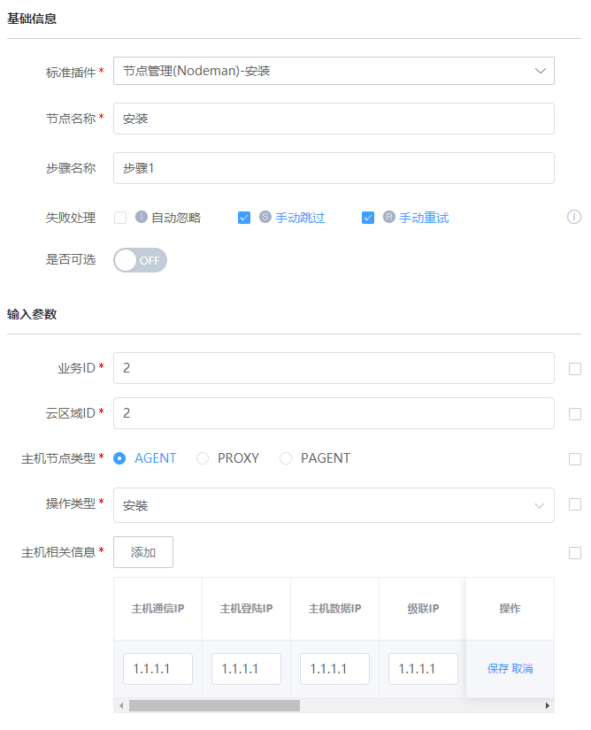

# Nodeman操作Agent和Proxy

### 介绍

该插件可以批量安装、卸载Agent和Proxy等操作

### 标签

`nodeman` `agent` `proxy`

### 参数说明

#### 输入参数说明

- 业务ID:

- 云区域ID:

- 主机节点类型：

- 操作类型：

  对于agent或proxy的操作类型

- 主机相关信息：

- 通过表格形式输入节点：

  - 主机通信IP:

    多个用英文逗号隔开

  - 主机登陆IP:

    适配复杂网络时填写

  - 主机数据IP:

    适配复杂网络时填写

  - 级联IP:

    安装Proxy时必填

  - 操作系统类型:

  - 是否安装cygwin:

    选择windows系统时选填

  - 端口号:

  - 登陆账号:

  - 认证方式:

    选择密码或是密钥

  - 登陆密码:

    选择认证方式为密码时填写

  - 登陆密钥:

    选择认证方式为密钥时填写

#### 输出参数说明

- 执行结果：

  系统展示的插件执行结果

### 样例

### 注意事项

- 安装Agent：

  选择安装Agent必须在直连区域内安装，也就是云区域ID为0

- 安装Proxy：

  安装Proxy必须在非直连区域内安装

  

  