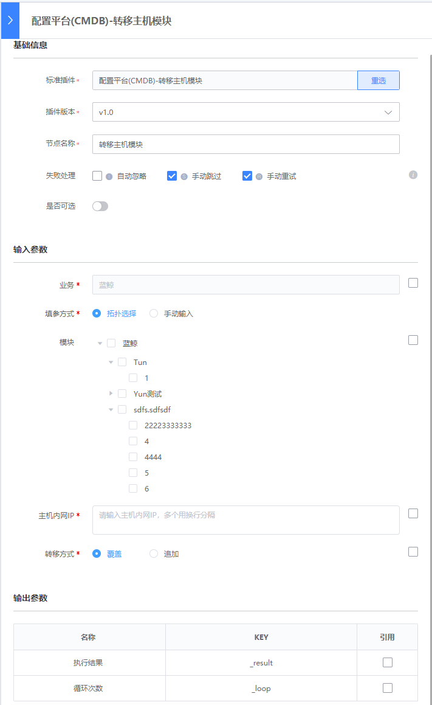

# 转移主机模块

## 介绍

业务内主机转移模块

## 标签
`cc` `cmdb` `create_set` 

## 参数说明

* `biz_cc_id` 业务id

* `cc_module_select_method` 选择模块的方式
    * `text`: 文本输入
    * `topo`: 树形组件上勾选

* `cc_module_select_topo` 树形组件勾选的模块列表
   * 列表元素结构：`{bz_inst_name}_{bz_inst_id}`

* `cc_module_select_text` 文本输入的模块路径集合
    * 换行区分路径，`>`区分层级
    * example: `a>b>c\n   a>b`
    * 已容错：冗余回车/空格
 
* `cc_host_ip`
    * 待转移的主机内网 IP，多个用英文逗号 `,` 分隔

* `cc_is_increment`
    * 主机转移方式，覆盖(false)或追加(true)

## 输出参数说明

* 执行结果：

  系统展示的插件执行结果

## 样例

切换为手动输入

## 注意事项

* `cc_module_select_topo` 字段只在`cc_module_select_method`为`topo`时有效

* `cc_module_select_text` 字段只在`cc_module_select_method`为`text`时有效
  

  