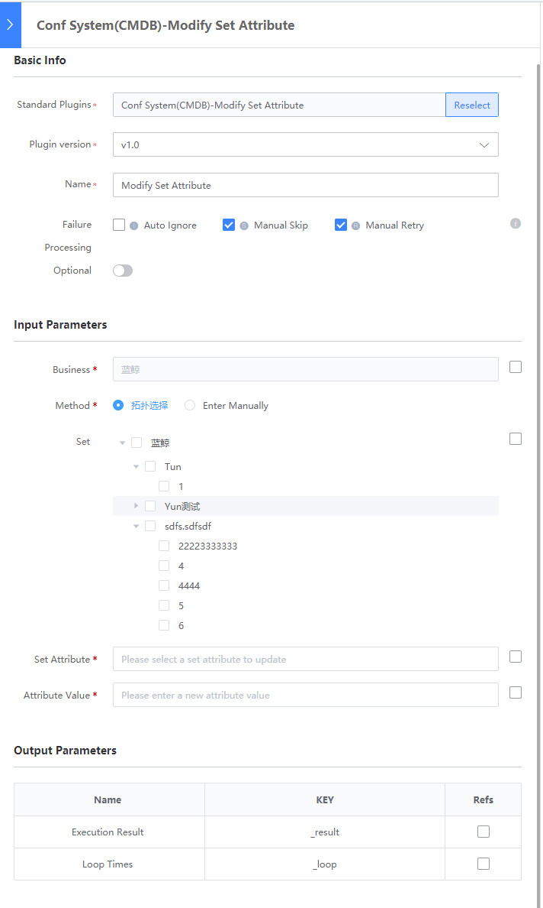
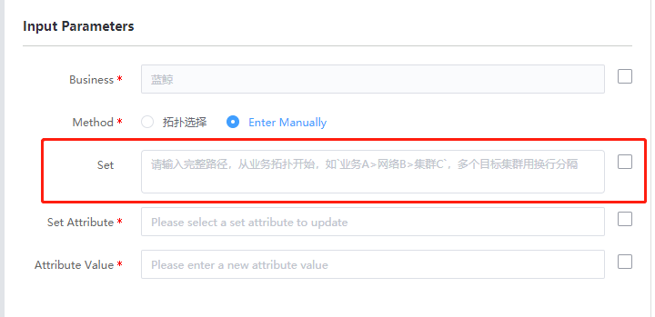

# 更新集群属性

## 介绍

更新集群属性

## 标签

`cc` `cmdb` `update_set` 

## 参数说明

* `biz_cc_id` 业务id

* `cc_set_select_method` 选择集群的方式
  * `text`: 文本输入
  * `topo`: 树形组件上勾选

* `cc_set_select_topo` 树形组件勾选的集群列表
  * 列表元素结构：`{bz_inst_name}_{bz_inst_id}`

* `cc_set_select_text` 文本输入的集群路径集合
  * 换行区分路径，`>`区分层级
  * example: `a>b>c\n   a>b`
  * 已容错：冗余回车/空格
  
* `cc_set_property` 集群属性

* `cc_set_prop_value` 集群属性更新后的值

## 输出参数说明

* 执行结果：

  系统展示的插件执行结果

## 样例

切换为手动输入

## 注意事项

* `cc_set_select_topo` 字段只在`cc_set_select_method`为`topo`时有效

* `cc_set_select_text` 字段只在`cc_set_select_method`为`text`时有效

  