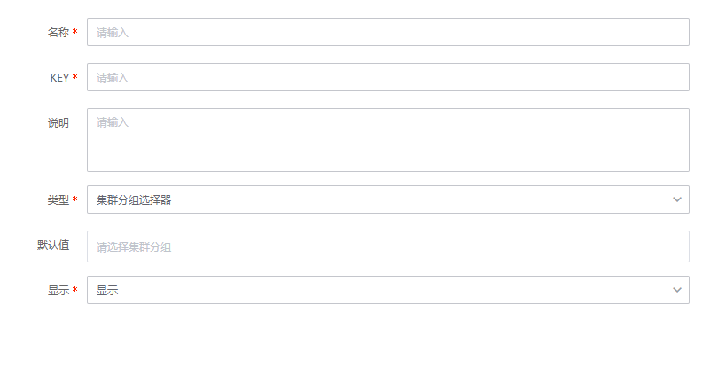

# 集群分组选择器变量
> 版本 `legacy`

## 介绍

全局变量配置，集群分组选择器变量


## 标签

`cmdb` `set_group_selector` 

## 参数说明

### 全局变量设置参数

* `名称`：全局变量名称
* `KEY`: 全局变量名，用于后续引用全局变量
* `描述`: 全局变量描述


### 输入参数

* `set_group_selector`: 集群分组ID 

### 返回参数及格式

* `bk_set_id` 集群ID列表
* `bk_set_name` 集群名称列表
* `flat__set_id` 字符串格式的集群名称
* `flat__set_name` 字符串格式的集群ID
* ...

* 返回格式
```
{
    "bk_capacity": [],
    "bk_service_status": ["1"],
    "bk_set_desc": [],
    "bk_set_env": ["3"],
    "bk_set_id": ["8"],
    "bk_set_name": ["PaaS\u5e73\u53f0"],
    "description": [],
    "aaa": [],
    "flat__bk_capacity": "",
    "flat__bk_service_status": "1",
    "flat__bk_set_desc": "",
    "flat__bk_set_env": "3",
    "flat__bk_set_id": "8",
    "flat__bk_set_name": "PaaS\u5e73\u53f0",
    "flat__description": "",
    "flat__aaa": "",
}
```


## 使用说明

> 填写该变量的名称、key以及说明（选填）<br>
> 点击 “默认值” 后面的下拉框，选择一个集群分组 <br>
> 字符串格式的参数名称格式为`flat` + 双下划线（`__`） + 参数id


## 样例


