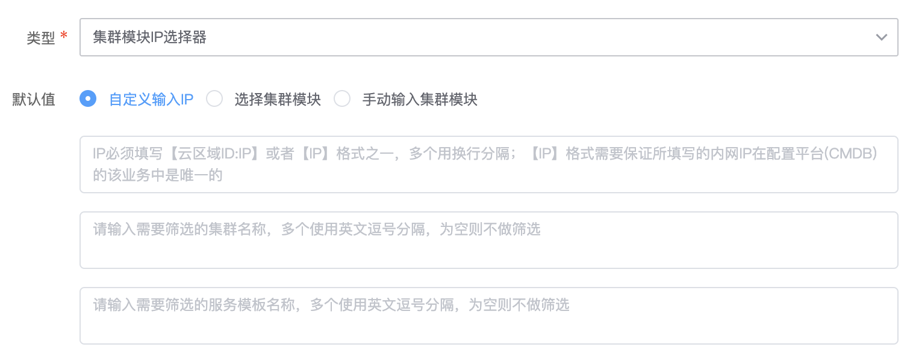
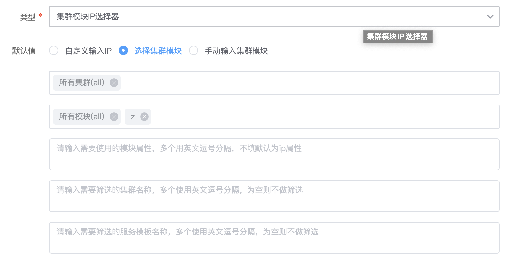
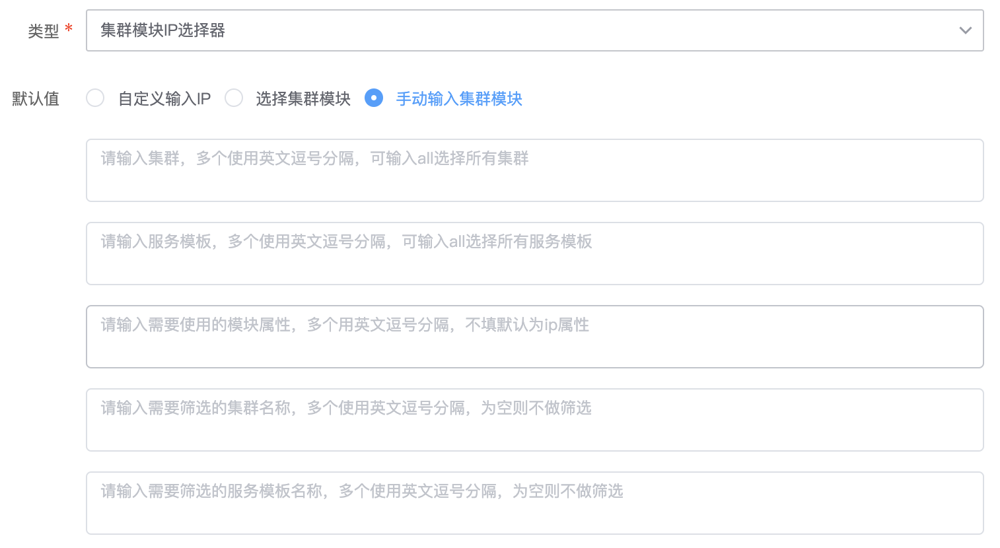

# 集群模块ip选择器变量
> 版本 `legacy`

## 介绍

全局变量配置，集群模块ip选择器变量


## 标签

`cmdb` `set_module_ip_selector` 

## 参数说明

### 全局变量设置参数

* `名称`：全局变量名称
* `KEY`: 全局变量名，用于后续引用全局变量
* `描述`: 全局变量描述


### 输入参数

- 自定义输入ip

    * `ip`: IP必须填写【管控区域ID:IP】或者【IP】格式之一，多个用换行分隔；【IP】格式需要保证所填写的内网IP在配置平台(CMDB)的该业务中是唯一的
    * `筛选集群`: 筛选集群名称，英文逗号分隔
    * `筛选服务模板`: 筛选服务模板名称，英文逗号分隔

- 选择集群模块
    
    * `集群`: 选择集群
    * `服务模板`: 选择服务模板
    * `模块属性`: 输入模块属性，为空时默认使用ip
    * `筛选集群`: 筛选集群名称，英文逗号分隔
    * `筛选服务模板`: 筛选服务模板名称，英文逗号分隔

- 手动输入集群模块
    
    * `集群`: 输入集群
    * `服务模板`: 输入服务模板
    * `模块属性`: 输入模块属性，为空时默认使用ip
    * `筛选集群`: 筛选集群名称，英文逗号分隔
    * `筛选服务模板`: 筛选服务模板名称，英文逗号分隔

### 返回参数及格式
    
* `set_name` 集群名称
* `set_id` 集群ID
* `module_name` 列表格式的模块名称
* `module_id` 列表格式的模块ID
* `flat__module_name` 字符串格式的模块名称
* `flat__module_id` 字符串格式的模块ID

* 返回格式
```
{
    "var_ip_method": "select",
    "var_ip_custom_value": "",
    "var_ip_select_value": {
        "var_set": [
            "空闲机池",
            "all"
        ],
        "var_module": [
            "z",
            "x"
        ],
        "var_module_name": ""
    },
    "var_ip_manual_value": {
        "var_manual_set": "",
        "var_manual_module": "",
        "var_module_name": ""
    },
    "var_filter_set": "",
    "var_filter_module": ""
}
```


## 使用说明

> 填写该变量的名称、key以及说明（选填）


## 样例

自定义输入ip



选择集群模块



手动输入集群模块


