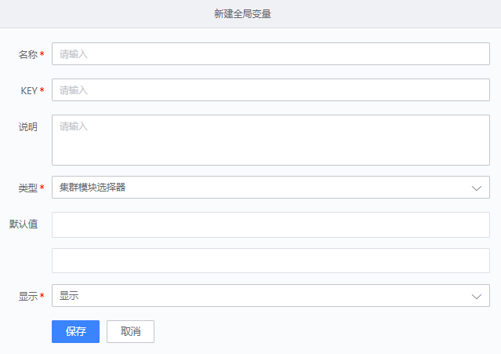

# 集群模块选择器变量
> 版本 `legacy`

## 介绍

全局变量配置，集群模块选择器变量


## 标签

`cmdb` `set_module_selector` 

## 参数说明

### 全局变量设置参数

* `名称`：全局变量名称
* `KEY`: 全局变量名，用于后续引用全局变量
* `描述`: 全局变量描述


### 输入参数

* `bk_set_id`: 集群ID 
* `bk_module_id`: 模块ID 


### 返回参数及格式
    
* `set` 集群名称
* `set_id` 集群ID
* `module` 模块名称
* `module_id` 模块ID

* 返回格式
```
{
    "set": "set_name",
    "set_id": 123,
    "module": "module_name",
    "module_id": 456
}
```


## 使用说明

> 填写该变量的名称、key以及说明（选填）
>点击 “默认值” 后面的下拉框，选择一个集群
>然后再点击下一个下拉框，选择该集群下的某一个模块，保存即可  


## 样例


