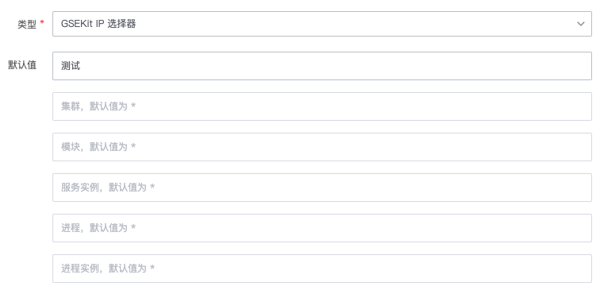

# 集群模块ip选择器变量
> 版本 `legacy`

## 介绍

全局变量配置，Gse Kit ip选择器变量


## 标签

`gse_kit` `ip_selector` 

## 参数说明

### 全局变量设置参数

* `名称`：全局变量名称
* `KEY`: 全局变量名，用于后续引用全局变量
* `描述`: 全局变量描述


### 输入参数

* `var_set_env` 集群环境类型
* `var_set_name` 集群
* `var_module_name` 模块
* `var_service_instance_name` 服务实例
* `var_process_name` 进程
* `var_process_instance_id` 进程实例

### 返回参数及格式
    
* `var_set_env` 集群环境类型
* `var_set_name` 集群
* `var_module_name` 模块
* `var_service_instance_name` 服务实例
* `var_process_name` 进程
* `var_process_instance_id` 进程实例

* 返回格式
```
{
    "var_set_env": "1",
    "var_set_name": "",
    "var_module_name": "",
    "var_service_instance_name": "",
    "var_process_name": "",
    "var_process_instance_id": ""
}
```


## 使用说明

> 填写该变量的名称、key以及说明（选填）


## 样例




