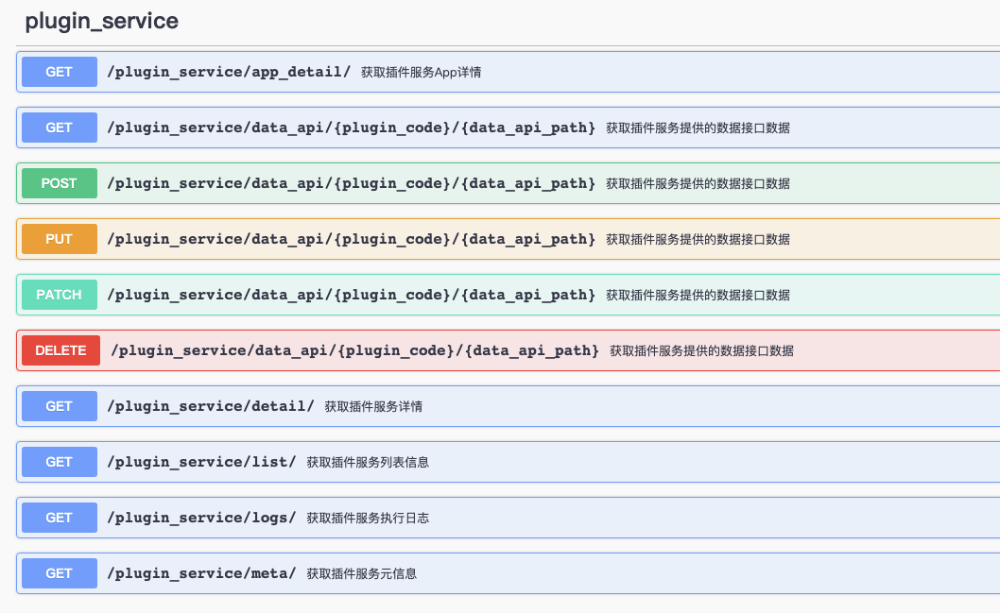

# 蓝鲸标准插件服务接入SDK


## bk-plugin-service
plugin_service是一个用于在Django工程中快速接入蓝鲸标准插件服务的SDK。开发者只需要在蓝鲸PaaS平台上申请对应的接口API请求token，并在自己的项目中进行简单的配置，即可在自己的项目中快速接入蓝鲸标准插件服务。


## 快速接入

1. 在蓝鲸PaaS平台申请调用API接口的请求token。

2. 在config/default.py中添加对应的app: 
``` python
INSTALLED_APPS += (
    ...,
    "plugin_service",
    ...
)
```

3. 在urls.py中配置对应的路由:
``` python
urlpatterns = [
    ...,
    url(r"^plugin_service/", include("plugin_service.urls")),
    ...,
]
```

4. 添加对应的环境变量:
``` text
# 必配项
BKAPP_USE_PLUGIN_SERVICE=1  # 开启插件服务
BKAPP_PAASV3_APIGW_API_TOKEN=token  # 在PaaS平台申请的token
BKAPP_APIGW_URL_SUFFIX=xxx  # 对应环境APIGW的域名后缀(除了调用系统后面统一的部分)

# 选配项
BKAPP_APIGW_ENVIRONMENT=prod  # 调用APIGW接口的环境，默认值为settings.ENVIRONMENT
BKAPP_APIGW_NETWORK_PROTOCAL=http  # 对应环境APIGW的网络协议，默认值为http
```

至此，sdk已完成接入。

## 服务接口
接入sdk之后，项目将获得以下暴露给前端的服务接口，帮助项目快速完成跟插件服务相关的交互和操作。


如果项目之前未进行Swagger UI相关配置，需要进行相应配置: [快速配置Swagger UI](docs/openapi_config.md)。

