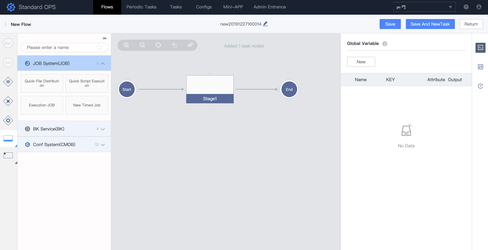

---

Standard OPS is a product in the Tencent Blueking product system, designed to arrange task process and execution
 through a visual graphical interface.

Standard OPS provides two core services. One is scheduling arrangement service: based on the capability of The BlueKing
 PaaS API Gateway to connect various system APIs of an enterprise, integrate the works among multiple systems within 
 the enterprise into a task flow, so as to achieve one-key automated scheduling.The other is self-service: Standard OPS
 shields the difference of the underlying system, allowing the operation and maintenance personnel to hand over the 
 daily operation and maintenance of the business to the personnel of the product, development, test, etc., to realize
 the self-service of the release and change of the business. By means of in-depth integration with BlueKing PaaS,
 Standard OPS provides users with “Min-APP” and “Functional Center”, so that we can further reduce the user's operating
 costs and increase the self-service rate.

The background uses Python as the development language and Django development framework. The front end uses Vue to
 develop the page, uses jQuery to develop the Standard Plugins, and through the configuration development mode, it
 greatly reduces the difficulty for users to develop front-end forms of Standard Plugins.

## Overview
- [Architecture Design (In Chinese)](docs/overview/architecture.md)
- [Code Directory (In Chinese)](docs/overview/code_structure.md)
- [Use Scenario (In Chinese)](docs/overview/usecase.md)
- Overall View

## Features
- Multi-system access support: Standard OPS docks services such as Blueking Message Management, Configuration System, 
 Job System, and also supports user-defined access to the internal system of the enterprise.
- Visual task flow arrangement: combine Standard Plugins nodes into a flow template by dragging and dropping.
- Multiple process modes: support serial and parallel execution of Standard Plugins nodes, support sub-process, 
 automatic branch selection based on global variables, and configurable node failure handling.
- Parameter engine: support parameter sharing and parameter replacement.
- Interactive task execution: ou can pause, continue, and cancel at any time during task execution. After the node
 fails, you can retry or skip.
- Universal Rights Management: Synchronize business roles from configuring system to support the permission control of
 flow templates.

If you want to know more about the above features, please refer to the
 [Blueking Standard OPS White Paper (In Chinese)](https://docs.bk.tencent.com/gcloud/)

## Getting started
- [Development Background Deployment (In Chinese)](docs/install/dev_deploy.md)
- [Development Front-end Deployment (In Chinese)](docs/install/dev_web.md)
- [Production Source Deployment (In Chinese)](docs/install/source_code_deploy.md)
- [Production Upload Deployment (In Chinese)](docs/install/upload_pack_deploy.md)
- [Mobile Deployment (In Chinese)](docs/install/mobile_deploy.md)
- [Standard Plugin Development](docs/develop/dev_plugins.md)

## Roadmap
- [Release Notes](docs/release.md)

## Support
- [Source (In Chinese)](https://github.com/Tencent/bk-sops/tree/master)
- [Wiki (In Chinese)](https://github.com/Tencent/bk-sops/wiki) or ask for help
- [White paper(In Chinese)](http://docs.bk.tencent.com/product_white_paper/gcloud/)
- [BK forum](https://bk.tencent.com/s-mart/community)
- [BK DevOps online video tutorial(In Chinese)](https://cloud.tencent.com/developer/edu/major-100008)
- [BK community QQ group](https://jq.qq.com/?_wv=1027&k=5zk8F7G)
- Contact us, technical exchange QQ group：878501914

## BlueKing Community
- [BK-CI](https://github.com/Tencent/bk-ci)：a continuous integration and continuous
 delivery system that can easily present your R & D process to you.
- [BK-BCS](https://github.com/Tencent/bk-bcs)：a basic container service platform which provides
 orchestration and management for micro-service business.
- [BK-BCS-SaaS](https://github.com/Tencent/bk-bcs-saas)：a SaaS provides users with highly scalable
, flexible and easy-to-use container products and services.
- [BK-PaaS](https://github.com/Tencent/bk-PaaS)：an development platform that allows developers to create, develop, deploy and manage SaaS applications easily and quickly.
- [BK-SOPS](https://github.com/Tencent/bk-sops)：an lightweight scheduling SaaS  for task flow
 scheduling and execution through a visual graphical interface. 
- [BK-CMDB](https://github.com/Tencent/bk-cmdb)：an enterprise-level configuration management platform for assets and applications.

## Contributing
If you have good ideas or suggestions, please let us know by Issues or Pull Requests and contribute to the Blue Whale
 Open Source Community. For Standard SOPS branch management, issues, and pr specifications, read the
 [Contributing Guide](docs/CONTRIBUTING.md)。

If you are interested in contributing, check out the [CONTRIBUTING.md], also join our
 [Tencent OpenSource Plan](https://opensource.tencent.com/contribution).

## Usage
- [API Documents](docs/apidoc/readme.md)
- [Standard Plugin Remote Importing](docs/features/remote_plugins.md)
- [Variables Engine](docs/features/variables_engine.md)
- [Mobile Documents](docs/features/mobile.md)

## FAQ
[FAQ (In Chinese)](docs/wiki/faq.md)

## License
Standard OPS is based on the MIT protocol. Please refer to [LICENSE](LICENSE.txt) for details.
