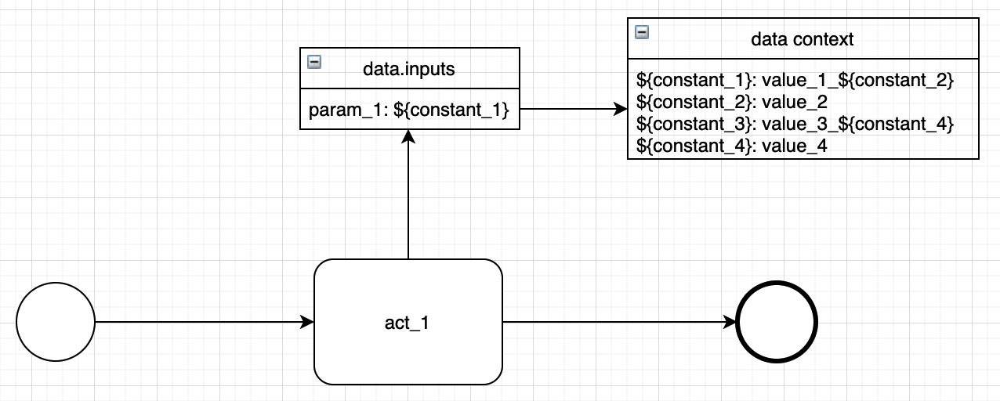

<!-- TOC -->

- [SPLICE 变量](#splice-变量)
  - [变量引用](#变量引用)
  - [python 操作](#python-操作)

<!-- /TOC -->

## SPLICE 变量

SPLICE 类型的变量能够帮助我们声明变量与变量间的引用关系，灵活使用 SPLICE 类型的变量能够在流程中实现很多复杂的数据交互操作。**我们通过 `${xxxx}` 的形式来声明对数据上下文中某个变量的引用；另外，数据上下文中只有 key 为 `${xxxx}` 形式的变量能够被 SPLICE 变量引用。**

所有的 SPLICE 类型的变量在创建时仅仅声明了他们的引用关系，并没有进行解析操作。在流程中的节点执行前，引擎会解析该节点数据对象输入中所有的 SPLICE 变量，在解析的过程中，直接或间接被这些 SPLICE 变量引用的其他 SPLICE 变量也会被解析。以下面的场景为例



当 act_1 执行前，引擎会解析其数据对象输入中的 `param_1` 变量，因为 `param_1` 直接引用了数据上下文中的 `${constant_1}` 变量，所以 `${constant_1}` 的值也会被解析，一直解析到 `${constant_2}`。而数据上下文中的 `${constant_3}`，`${constant_4}` 因为没有被 act_1 中的变量引用，所以就没有进行解析。

### 变量引用

以下面一个场景为例，我们的 act_1 的 `param_1` 输入需要引用数据上下文中定义的 `${constant_1}` 变量


那么我们可以按照以下的方式来声明这两个变量之间的关系，当 act_1 执行前，`param_1` 解析后其值应为 `value_1`。

```python
# in act_1 component inputs
{
    'param_1': {
        'type': 'splice',
        'value': '${constant_1}'
    }
}

# in data context inputs
{
    '${constant_1}': {
        'type': 'plain',
        'value': 'value_1'
    }
}
```

当然，变量之间也能够存在链式的引用关系


声明方式如下，`param_1` 解析后其值应为 `value_1_value_2_value_3`：

```python
# in act_1 component inputs
{
    'param_1': {
        'type': 'splice',
        'value': '${constant_1}'
    }
}

# in data context inputs
{
    '${constant_1}': {
        'type': 'plain',
        'value': 'value_1_${constant_2}'
    },
    '${constant_2}': {
        'type': 'plain',
        'value': 'value_2_${constant_3}'
    },
    '${constant_3}': {
        'type': 'plain',
        'value': 'value_3'
    },
}

```

一个变量引用多个变量当然也是支持的


声明方式如下，`param_1` 解析后其值应为 `value_1__value_2`：

```python
# in act_1 component inputs
{
    'param_1': {
        'type': 'splice',
        'value': '${constant_1}__${constant_2}'
    }
}

# in data context inputs
{
    '${constant_1}': {
        'type': 'plain',
        'value': 'value_1'
    },
    '${constant_2}': {
        'type': 'plain',
        'value': 'value_2'
    }
}
```

### python 操作

除了通过 `${xxx}` 语法引用数据上下文中的变量，引擎还支持对变量执行一些 python 操作

- 字符串拼接：`${"prefix" + KEY}`、`${"prefix%s" % KEY}`、`${"prefix{}".format(KEY)}`、`${"%s%s" % (KEY1, KEY2)}`

- 字符串变换：`${KEY.upper()}`、`${KEY.replace("\n", ",")}`、`${KEY[0:2]}`、`${KEY.strip()}`

- 数字运算：`${int(KEY) + 1}`、`${int(KEY)/10}`

- 类型转换：`${KEY.split("\n")}`、`${KEY.count()}`、`${list(KEY)}`、`${[item.strip() for item in KEY.split("\n")]}`

基本上 python 中能够在一行语句中实现的操作，都能够在 SPLICE 变量中实现

