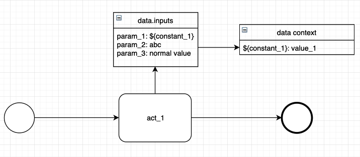
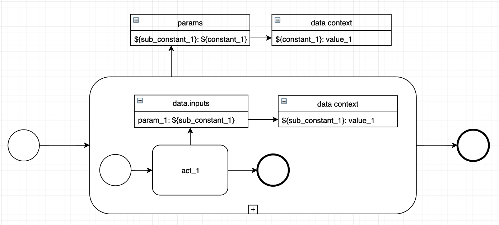

<!-- TOC -->

- [如何编排流程](#%E5%A6%82%E4%BD%95%E7%BC%96%E6%8E%92%E6%B5%81%E7%A8%8B)
    - [开始与结束](#%E5%BC%80%E5%A7%8B%E4%B8%8E%E7%BB%93%E6%9D%9F)
    - [活动](#%E6%B4%BB%E5%8A%A8)
    - [网关](#%E7%BD%91%E5%85%B3)
        - [并行网关](#%E5%B9%B6%E8%A1%8C%E7%BD%91%E5%85%B3)
        - [分支网关](#%E5%88%86%E6%94%AF%E7%BD%91%E5%85%B3)
        - [条件并行网关](#%E6%9D%A1%E4%BB%B6%E5%B9%B6%E8%A1%8C%E7%BD%91%E5%85%B3)
    - [子流程](#%E5%AD%90%E6%B5%81%E7%A8%8B)
    - [数据交换](#%E6%95%B0%E6%8D%AE%E4%BA%A4%E6%8D%A2)
        - [Data](#data)
        - [Var](#var)
        - [NodeOutput](#nodeoutput)
        - [RewritableNodeOutput](#rewritablenodeoutput)
        - [DataInput & Params](#datainput--params)
    - [流程结构合法性](#%E6%B5%81%E7%A8%8B%E7%BB%93%E6%9E%84%E5%90%88%E6%B3%95%E6%80%A7)
    - [节点合法性](#%E8%8A%82%E7%82%B9%E5%90%88%E6%B3%95%E6%80%A7)
    - [网关配对合法性](#%E7%BD%91%E5%85%B3%E9%85%8D%E5%AF%B9%E5%90%88%E6%B3%95%E6%80%A7)
    - [流程合法性](#%E6%B5%81%E7%A8%8B%E5%90%88%E6%B3%95%E6%80%A7)

<!-- /TOC -->

## 如何编排流程

在开始使用流程引擎之前，我们要先了解一下如何才能够编排出我们想要的流程。

### 开始与结束

在一个合法的流程中，开始事件和结束事件是必须存在的，也就是说，我们其实是在开始事件节点与结束事件节点之间自由的定义我们的流程结构，然后再将这些节点连接起来：

```python
from pipeline.builder import EmptyStartEvent, ServiceActivity, EmptyEndEvent

start = EmptyStartEvent()
act_1 = ServiceActivity()
act_2 = ServiceActivity()
...
end = EmptyEndEvent()


start.extend(act1) \
     .extend(act2) \
     ... \
     .extend(end)

```

### 活动

活动是流程中最重要的元素，活动节点中能够执行任意的逻辑，例如（发起网络请求，操作数据库，执行命令等等），流程中活动节点的类型及其编排的顺序就决定了这个流程的能力，在 pipeline 中，活动本身是没有定义自身的行为的，其通过与**组件**进行绑定从而获得组件执行的能力，你可以通过开发自定义组件来扩充活动节点的能力范围，pipeline 中的每一个组件都拥有一个唯一的 `code`，通过这个 `code`，在 Quick Start 的例子中，活动通过与 `code` 为 example_component 的组件绑定而获得了该组件的执行能力：

```python
from pipeline.builder import ServiceActivity

act = ServiceActivity(component_code='example_component')
```

pipeline 提供的 example_component 这个组件在执行的过程中什么都不做：

```python
class SimpleExampleService(Service):
    def execute(self, data, parent_data):
        return True

    def outputs_format(self):
        return []

class SimpleExampleComponent(Component):
    name = u'example component'
    code = 'example_component'
    bound_service = SimpleExampleService
```

关于自定义组件的知识，在后续的章节中会详细说明。

### 网关

网关在流程执行的过程中起到了引流的作用，同时，网关可能会改变流程的执行模式。目前 pipeline 中可用的网关及其作用如下：

 - 分支网关：分支网关可以发散出多条顺序流，每条顺序流会与一个布尔表达式进行绑定，当流程执行到分支网关时，引擎会在当前流程的数据上下文中执行该分支网关中的分支表达式，引擎会选择与第一个结果为真的表达式所绑定的顺序流往下继续执行，分支网关并不会改变流程的执行模式。
 - 并行网关：并行网关可以发散出多条顺序流，同时其会改变当前流程的执行模式，当流程执行到并行网关时，流程会进入并行执行的模式，此时并行网关后的每一条分支会被同时执行，直到其遇到一个汇聚网关。pipeline 中同一个并行网关发散的所有分支都必须汇聚到同一个汇聚网关中。
 - 条件并行网关：条件并行网关可以发散出多条顺序流，并且每条顺序流也会与一个布尔表达式绑定，同时其会改变当前流程的执行模式，当流程执行到条件并行网关时，流程会进入并行执行的模式，但是此时引擎只会执行在当前数据上下文中布尔表达式结果为真的分支。
 - 汇聚网关：汇聚网关能够连接多条输入顺序流，并只能输出一条顺序流。汇聚网关的作用是将其他网关发散出去的多条顺序流汇聚成一条顺序流。

#### 并行网关

并行网关允许我们让流程的执行进入并行执行的状态，系列代码创建了一个包含三个活动节点（act_1, act_2, act_3）及一个并行网关的流程，并行网关后的 act_1, act_2, act_3 会被引擎并行执行：


```python
from pipeline import builder
from pipeline.parser import PipelineParser
from pipeline.service import task_service
from pipeline.builder import (EmptyStartEvent, 
                              ServiceActivity, 
                              EmptyEndEvent, 
                              ParallelGateway, 
                              ConvergeGateway)

start = EmptyStartEvent()
pg = ParallelGateway()
act_1 = ServiceActivity(component_code='pipe_example_component', name='act_1')
act_2 = ServiceActivity(component_code='pipe_example_component', name='act_2')
act_3 = ServiceActivity(component_code='pipe_example_component', name='act_3')
cg = ConvergeGateway()
end = EmptyEndEvent()

start.extend(pg).connect(act_1, act_2, act_3).to(pg).converge(cg).extend(end)

tree = builder.build_tree(start)
parser = PipelineParser(pipeline_tree=tree)
pipeline = parser.parse()


task_service.run_pipeline(pipeline)
```

这里需要注意的是，并行网关发散出去的所有分支最后都要汇聚到同一个汇聚网关中，上述代码中的 `to(pg).converge(cg)` 调用实现了这个操作。

#### 分支网关

分支网关允许我们通过当前流程数据上下文中的数据来决定之后流程执行的方向，下列代码创建了一个包含三个活动节点（act_1, act_2, act_3）及一个分支网关的流程，分支网关会根据 act_1 节点输出到数据上下文中的变量来判断接下来是执行 act_2 还是 act_3 节点：


```python
from pipeline import builder
from pipeline.parser import PipelineParser
from pipeline.service import task_service
from pipeline.builder import (EmptyStartEvent, 
                              ServiceActivity, 
                              EmptyEndEvent, 
                              ExclusiveGateway, 
                              Var, 
                              Data,
                              NodeOutput)

start = EmptyStartEvent()
act_1 = ServiceActivity(component_code='pipe_example_component', name='act_1')
eg = ExclusiveGateway(
    conditions={
        0: '${act_1_output} < 0',
        1: '${act_1_output} >= 0'
    },
    name='act_2 or act_3'
)
act_2 = ServiceActivity(component_code='pipe_example_component', name='act_2')
act_3 = ServiceActivity(component_code='pipe_example_component', name='act_3')
end = EmptyEndEvent()

start.extend(act_1).extend(eg).connect(act_2, act_3).to(eg).converge(end)

act_1.component.inputs.input_a = Var(type=Var.SPLICE, value='${input_a}')

pipeline_data = Data()
pipeline_data.inputs['${input_a}'] = Var(type=Var.PLAIN, value=0)
pipeline_data.inputs['${act_1_output}'] = NodeOutput(type=Var.SPLICE, source_act=act_1.id, source_key='input_a')

tree = builder.build_tree(start, data=pipeline_data)
parser = PipelineParser(pipeline_tree=tree)
pipeline = parser.parse()


task_service.run_pipeline(pipeline)
```

我们一步步来看这个流程的声明，首先我们创建了绑定了 pipe_example_component 组件的活动节点，该组件会把其接收到的输入参数原封不动的写到当前节点的输出中：

```python
act_1 = ServiceActivity(component_code='pipe_example_component', name='act_1')
```

然后我们创建了分支网关，并设定了其要绑定到输出顺序流中的布尔表达式，`condition` 字段接收一个字典，该字典表示将 value 指定的表达式绑定到第 key 个输出顺序流上，示例中的 `condition` 表示将 `${act_1_output} < 0` 表达式绑定到分支网关的第 `0` 个输出顺序流上。

```python
eg = ExclusiveGateway(
    conditions={
        0: '${act_1_output} < 0',
        1: '${act_1_output} >= 0'
    },
    name='act_2 or act_3'
)
```

然后我们完成了流程的编排（分支网关输出顺序流的排列与节点的连接顺序相关，`connect(act_2, act_3)` 调用中参数传递的顺序决定了 `eg -> act_2` 为 eg 的第0个输出顺序流）：

```python
start.extend(act_1).extend(eg).connect(act_2, act_3).to(eg).converge(end)
```

完成了流程的编排后，我们需要配置这个流程中数据交互的方式，我们需要做两件事情：

- 配置 act_1 的输入
- 配置 act_1 到流程数据上下文的输出

首先，我们为 act_1 配置了一个 key 为 `input_a` 的输入参数，该参数会引用流程上下中的 `${input_a}` 变量：

```python
act_1.component.inputs.input_a = Var(type=Var.SPLICE, value='${input_a}')
```

然后，我们创建了一个初始的流程数据上下文，并为其设置了一个值为 `0` key 为 `${input_a}` 的全局变量：

```python
pipeline_data = Data()
pipeline_data.inputs['${input_a}'] = Var(type=Var.PLAIN, value=0)
```

随后，我们声明了一个 key 为 `${act_1_output}` 的全局变量，该变量是对 act_1 输出数据中 key 为 `input_a` 的变量的引用：

```python
pipeline_data.inputs['${act_1_output}'] = NodeOutput(type=Var.SPLICE, source_act=act_1.id, source_key='input_a')
```

下图展示了这个流程中数据交换的过程：


后面就是构造流程描述结构、创建流程对象并执行了：

```python
tree = builder.build_tree(start, data=pipeline_data)
parser = PipelineParser(pipeline_tree=tree)
pipeline = parser.parse()


task_service.run_pipeline(pipeline)
```

执行后获取流程状态可以看到，只有 act_2 与 act_3 中只有 act_3 执行了（`'${act_1_output} >= 0'` 绑定的 `eg -> act_3` 顺序流）：

```bash
>>> task_service.get_state(pipeline.id)
{
    ...
  u'bdb6de805a183c18a131ea49509197b8': {'finish_time': '2019-03-28 08:08:54',
   'id': u'bdb6de805a183c18a131ea49509197b8',
   'loop': 1L,
   'name': u'act_3',
   'retry': 0L,
   'skip': False,
   'start_time': '2019-03-28 08:08:53',
   'state': 'FINISHED'},
  u'e5bce7ca4da63f6da89e47d012e2773c': {'finish_time': '2019-03-28 08:08:53',
   'id': u'e5bce7ca4da63f6da89e47d012e2773c',
   'loop': 1L,
   'name': u'act_1',
   'retry': 0L,
   'skip': False,
   'start_time': '2019-03-28 08:08:53',
   'state': 'FINISHED'},
   ...
   },
   ...
}
```

把流程上下文中的全局变量 `${input_a}` 的值改为 `-1` 后再次执行上述代码，可以看到这次只有 act_2 与 act_3 中只有 act_2 执行了：

```bash
>>> task_service.get_state(pipeline.id)
{
    ...
    u'191e41ec8c06365f8d30a06b331ed533': {'finish_time': '2019-03-28 08:20:22',
   'id': u'191e41ec8c06365f8d30a06b331ed533',
   'loop': 1L,
   'name': u'act_2',
   'retry': 0L,
   'skip': False,
   'start_time': '2019-03-28 08:20:22',
   'state': 'FINISHED'},
  u'efd7e68f479438f9941103a89a2130f4': {'finish_time': '2019-03-28 08:20:22',
   'id': u'efd7e68f479438f9941103a89a2130f4',
   'loop': 1L,
   'name': u'act_1',
   'retry': 0L,
   'skip': False,
   'start_time': '2019-03-28 08:20:22',
   'state': 'FINISHED'}
    ...
}
```

如果分支网关中的所有表达式执行结果都不为真，那么流程会进入执行失败的状态。

#### 条件并行网关

条件并行网关允许我们只并行执行部分在当前上下文下满足特定条件的分支：


```python
from pipeline import builder
from pipeline.parser import PipelineParser
from pipeline.service import task_service
from pipeline.builder import (EmptyStartEvent, 
                              ServiceActivity, 
                              EmptyEndEvent, 
                              ConditionalParallelGateway, 
                              ConvergeGateway,
                              Var, 
                              Data,
                              NodeOutput)

start = EmptyStartEvent()
act_1 = ServiceActivity(component_code='pipe_example_component', name='act_1')
cpg = ConditionalParallelGateway(
    conditions={
        0: '${act_1_output} < 0',
        1: '${act_1_output} >= 0',
        2: '${act_1_output} >= 0'
    },
    name='[act_2] or [act_3 and act_4]'
)
act_2 = ServiceActivity(component_code='pipe_example_component', name='act_2')
act_3 = ServiceActivity(component_code='pipe_example_component', name='act_3')
act_4 = ServiceActivity(component_code='pipe_example_component', name='act_4')
cg = ConvergeGateway()
end = EmptyEndEvent()

start.extend(act_1).extend(cpg).connect(act_2, act_3, act_4).to(cpg).converge(cg).extend(end)

act_1.component.inputs.input_a = Var(type=Var.SPLICE, value='${input_a}')

pipeline_data = Data()
pipeline_data.inputs['${input_a}'] = Var(type=Var.PLAIN, value=0)
pipeline_data.inputs['${act_1_output}'] = NodeOutput(type=Var.SPLICE, source_act=act_1.id, source_key='input_a')

tree = builder.build_tree(start, data=pipeline_data)
parser = PipelineParser(pipeline_tree=tree)
pipeline = parser.parse()


task_service.run_pipeline(pipeline)
```

首先，创建条件并行与创建分支网关类似，都需要为输出顺序流按序绑定布尔表达式：

```python
cpg = ConditionalParallelGateway(
    conditions={
        0: '${act_1_output} < 0',
        1: '${act_1_output} >= 0',
        2: '${act_1_output} >= 0'
    },
    name='[act_2] or [act_3 and act_4]'
)
```

由于条件并行网关会改变流程的执行模式，所以最后还是需要将其发散出去的分支汇聚到同一个汇聚网关上：

```python
extend(cpg).connect(act_2, act_3, act_4).to(cpg).converge(cg)
```

查看流程执行状态，可以发现只有 act_3 与 act_4 被执行了：

```bash
>>> task_service.get_state(pipeline.id)
{'children': {u'377d513285963a40951eea983e62f899': {'finish_time': '2019-03-28 13:48:43',
   'id': u'377d513285963a40951eea983e62f899',
   'loop': 1L,
   'name': u'act_4',
   'retry': 0L,
   'skip': False,
   'start_time': '2019-03-28 13:48:43',
   'state': 'FINISHED'},
  u'45d24e4595dd32b3ab65feddc73a75c3': {'finish_time': '2019-03-28 13:48:43',
   'id': u'45d24e4595dd32b3ab65feddc73a75c3',
   'loop': 1L,
   'name': u'act_1',
   'retry': 0L,
   'skip': False,
   'start_time': '2019-03-28 13:48:43',
   'state': 'FINISHED'},
  u'a4ee2f04cbdb3e87a5563f2907d5c42f': {'finish_time': '2019-03-28 13:48:43',
   'id': u'a4ee2f04cbdb3e87a5563f2907d5c42f',
   'loop': 1L,
   'name': u'[act_2] or [act_3 and act_4]',
   'retry': 0L,
   'skip': False,
   'start_time': '2019-03-28 13:48:43',
   'state': 'FINISHED'},
  u'bacfee844f313c7285b0e3f83f187745': {'finish_time': '2019-03-28 13:48:43',
   'id': u'bacfee844f313c7285b0e3f83f187745',
   'loop': 1L,
   'name': u'act_3',
   'retry': 0L,
   'skip': False,
   'start_time': '2019-03-28 13:48:43',
   'state': 'FINISHED'},
   ...
   }
}
```

同样的，如果条件并行网关中的所有表达式执行结果都不为真，那么流程会进入执行失败的状态。

### 子流程

子流程允许我们将一个包含多个节点的复杂操作放在一个节点中执行，子流程通常用于做公共流程的抽离，你可以将子流程理解为编程语言中的函数，通过将一些重复的执行逻辑放到子流程中，能够减少重复逻辑的编排：


```python
from pipeline import builder
from pipeline.parser import PipelineParser
from pipeline.service import task_service
from pipeline.builder import (EmptyStartEvent, 
                              ServiceActivity, 
                              EmptyEndEvent, 
                              ExclusiveGateway, 
                              SubProcess,
                              Var, 
                              Data,
                              NodeOutput)


subproc_start = EmptyStartEvent()
subproc_act = ServiceActivity(component_code='pipe_example_component', name='sub_act')
subproc_end = EmptyEndEvent()

subproc_start.extend(subproc_act).extend(subproc_end)

subproc_act.component.inputs.sub_input = Var(type=Var.SPLICE, value='${sub_input}')

start = EmptyStartEvent()
act_1 = ServiceActivity(component_code='pipe_example_component', name='act_1')
eg = ExclusiveGateway(
    conditions={
        0: '${act_1_output} < 0',
        1: '${act_1_output} >= 0'
    },
    name='act_2 or act_3'
)

sub_pipeline_data_1 = Data(inputs={'${sub_input}': Var(type=Var.PLAIN, value=1)})
subproc_1 = SubProcess(start=subproc_start, replace_id=True, data=sub_pipeline_data_1)

sub_pipeline_data_2 = Data(inputs={'${sub_input}': Var(type=Var.PLAIN, value=2)})
subproc_2 = SubProcess(start=subproc_start, replace_id=True, data=sub_pipeline_data_2)
end = EmptyEndEvent()

start.extend(act_1).extend(eg).connect(subproc_1, subproc_2).converge(end)

act_1.component.inputs.input_a = Var(type=Var.SPLICE, value='${input_a}')

pipeline_data = Data()
pipeline_data.inputs['${input_a}'] = Var(type=Var.PLAIN, value=0)
pipeline_data.inputs['${act_1_output}'] = NodeOutput(type=Var.SPLICE, source_act=act_1.id, source_key='input_a')

tree = builder.build_tree(start, data=pipeline_data)
parser = PipelineParser(pipeline_tree=tree)
pipeline = parser.parse()


task_service.run_pipeline(pipeline)
```

首先我们创建了一个子流程，为了简单说明子流程的作用，示例中的子流程只有一个活动节点，这个节点只有一个 `sub_input` 变量，该变量引用了流程数据上下文中的 `${sub_input}` 变量，也就是说，subproc_act 节点的输出会随着 `${sub_input}` 的变化而变化：

```python
subproc_start = EmptyStartEvent()
subproc_act = ServiceActivity(component_code='pipe_example_component', name='sub_act')
subproc_end = EmptyEndEvent()

subproc_start.extend(subproc_act).extend(subproc_end)

subproc_act.component.inputs.sub_input = Var(type=Var.SPLICE, value='${sub_input}')
```

随后，我们创建了一个带有分支网关的流程，这个流程会根据 act_1 节点的输出来选择 subproc_1 或 subproc_2 其中一个子流程执行：

```python
start = EmptyStartEvent()
act_1 = ServiceActivity(component_code='pipe_example_component', name='act_1')
eg = ExclusiveGateway(
    conditions={
        0: '${act_1_output} < 0',
        1: '${act_1_output} >= 0'
    },
    name='act_2 or act_3'
)

sub_pipeline_data_1 = Data(inputs={'${sub_input}': Var(type=Var.PLAIN, value=1)})
subproc_1 = SubProcess(start=subproc_start, replace_id=True, data=sub_pipeline_data_1)

sub_pipeline_data_2 = Data(inputs={'${sub_input}': Var(type=Var.PLAIN, value=2)})
subproc_2 = SubProcess(start=subproc_start, replace_id=True, data=sub_pipeline_data_2)
end = EmptyEndEvent()

start.extend(act_1).extend(eg).connect(subproc_1, subproc_2).converge(end)
```

这里需要说明一下子流程的声明方式，首先我们为子流程创建了一个数据上下文对象，这一步与流程对象的数据上下文声明一致，因为子流程本质上也是一个流程对象：

```python
sub_pipeline_data_1 = Data(inputs={'${sub_input}': Var(type=Var.PLAIN, value=1)})
```

之后，我们创建了一个子流程节点，这个子流程节点接受子流程的开始节点，ID 替换标志和数据上下文对象。这里需要额外说明的是 `replace_id` 这个参数，由于在引擎中，所有的流程（已执行和未执行的）中的每个节点的 ID 都必须是唯一的，但是每个节点的 ID 在节点创建完成后就不会改变了，所以如果我们在一个流程中需要复用同一个子流程的话，就需要将该子流程中所有的节点 ID 进行一次替换防止节点 ID 冲突：

```python
subproc_1 = SubProcess(start=subproc_start, replace_id=True, data=sub_pipeline_data_1)
```

在流程描述结构生成之后我们可以查看两个子流程中 sub_act 节点的 ID 与 subproc_act 创建时生成的 ID 互不相同：

```bash
>>> subproc_act.id
'4befcdac9a3d39abb6f55dcb11c1e284'
>>> for act in tree['activities'].values():
        if act['type'] == 'SubProcess':
            for act in act['pipeline']['activities'].values():
                if act['name'] == 'sub_act':
                    print(act['id'])
6cba092689af3a57b2679143685dbcde
8db1749af5343ab598fe9fe46d80e234
```

### 数据交换

#### Data

就如我们在[数据对象](./user_guide_basic_concept.md#数据对象)一节中所提到的，我们可以使用 `Data` 构造对象来定义一个流程的 data context：


```python
start = EmptyStartEvent()
act_1 = ServiceActivity(component_code='debug_node')
act_1.component.inputs.param_1 = Var(type=Var.SPLICE, value='${constant_1}')
end = EmptyEndEvent()

start.extend(act_1).extend(end)

pipeline_data = Data()
pipeline_data.inputs['${constant_1}'] = Var(type=Var.PLAIN, value='value_1')

tree = build_tree(start, data=data)
```

在上面的流程中，我们在先在 act_1 节点的输入中定义了一个 param_1 参数，该参数引用流程 data context 中的 `${constant_1}` 变量，随后我们通过 `Data` 构造了一个 data context，并在其输入域中定义了`'${constant_1}'` 变量。

#### Var

下面是一个使用了 `SPLICE`，`LAZY`，`PLAIN` 三种变量的流程示例，我们为 act_1 的输入添加了三个类型的变量，引用了全局变量的 param_1，类型为 `upper_case` 的 LAZY 变量（这个变量会在解析时使用前将 value 变成大写的格式）param_2，以及普通变量 param_3：



```python
start = EmptyStartEvent()
act_1 = ServiceActivity(component_code='debug_node')
act_1.component.inputs.param_1 = Var(type=Var.SPLICE, value='${constant_1}')
act_1.component.inputs.param_2 = Var(type=Var.LAZY, custom_type='upper_case', value='abc')
act_1.component.inputs.param_3 = Var(type=Var.PLAIN, value='normal var')
end = EmptyEndEvent()

start.extend(act_1).extend(end)

pipeline_data = Data()
pipeline_data.inputs['${constant_1}'] = Var(type=Var.PLAIN, value='value_1')

tree = build_tree(start, data=data)
```

#### NodeOutput

当我们要引用其他节点输出的变量时，就需要使用到 `NodeOutput` 来声明这种引用关系，下面是一个引用之前的节点输出的变量的例子：


```python
start = EmptyStartEvent()
act_1 = ServiceActivity(component_code='debug_node')
act_1.component.inputs.param_1 = Var(type=Var.PLAIN, value='output_value_1')
act_2 = ServiceActivity(component_code='debug_node')
act_2.component.inputs.param_2 = Var(type=Var.SPLICE, value='${act_1_output}')
end = EmptyEndEvent()

start.extend(act_1).extend(act_2).extend(end)

pipeline_data = Data()
pipeline_data.inputs['${act_1_output}'] = NodeOutput(source_act=act_1.id,
                                                     source_key='param_1',
                                                     type=Var.SPLICE,
                                                     value='')

tree = build_tree(start, data=data)
```

数据上下文中的 `${act_1_output}` 变量引用了 act_1 输出的 param_1，当 act_1 执行完后，`${act_1_output}` 的值为 `output_value_1`，act_2 中的 param_2 解析后的值为 `output_value_1`。

#### RewritableNodeOutput

`RewritableNodeOutput` 能够帮助我们在数据上下文中声明一个引用多个节点输出的变量，这个变量值会在其引用的节点执行完后进行刷新，下面是一个使用了 `RewritableNodeOutput` 的例子：


```python
start = EmptyStartEvent()
act_1 = ServiceActivity(component_code='debug_node')
act_1.component.inputs.param_1 = Var(type=Var.PLAIN, value='output_value_1')
act_2 = ServiceActivity(component_code='debug_node')
act_2.component.inputs.context_var = Var(type=Var.SPLICE, value='${rewritable_output}')
act_2.component.inputs.param_2 = Var(type=Var.PLAIN, value='output_value_2')
act_3 = ServiceActivity(component_code='debug_node')
act_3.component.inputs.context_var = Var(type=Var.SPLICE, value='${rewritable_output}')
end = EmptyEndEvent()

start.extend(act_1).extend(act_2).extend(act_3).extend(end)

pipeline_data = Data()
pipeline_data.inputs['${rewritable_output}'] = RewritableNodeOutput(source_act=[
    {
        'source_act': act_1.id,
        'source_key': 'param_1'
    },
    {
        'source_act': act_2.id,
        'source_key': 'param_2'
    }], type=Var.SPLICE, value='')

tree = build_tree(start, data=data)
```

数据上下文的 `${rewritable_output}` 变量引用了来自 act_1 及 act_2 两个节点的输出字段，当 act_1 执行完成时，`${rewritable_output}` 的值为 `output_value_1`，act_2 中 context_var 解析后的值为 `output_value_1`，当 act_2 执行完成后，`${rewritable_output}` 的值为 `output_value_2`，act_3 中 context_var 解析后的值为 `output_value2`。

#### DataInput & Params

`DataInput` 可以让我们将子流程数据上下文中的变量暴露出来，使得父流程能够通过 `Params` 来向子流程传递参数：



```python
sub_start = EmptyStartEvent()
sub_act_1 = ServiceActivity(component_code='debug_node')
sub_act_1.component.inputs.param_1 = Var(type=Var.SPLICE, value='${sub_constant_1}')
sub_end = EmptyEndEvent()

sub_start.extend(sub_act_1).extend(sub_end)

sub_pipeline_data = Data()
sub_pipeline_data.inputs['${sub_constant_1}'] = DataInput(type=Var.PLAIN, value='default_value')

start = EmptyStartEvent()
params = Params({
    '${sub_constant_1}': Var(type=Var.SPLICE, value='${constant_1}')
})
subprocess = SubProcess(start=sub_start, data=sub_pipeline_data, params=params)
end = EmptyEndEvent()

start.extend(subprocess).extend(end)

pipeline_data = Data()
pipeline_data.inputs['${constant_1}'] = Var(type=Var.PLAIN, value='value_1')

tree = build_tree(start, data=data)
```

上述例子定义的流程中，我们的子流程中包含一个 act_1 节点，该节点引用了数据上下文中的 `${sub_constant_1}`，而该子流程通过 `DataInput` 将 `${sub_constant_1}` 设置成了父流程暴露的参数，如果父流程在使用子流程时没有修改这个变量的定义的话，该变量就会使用默认的定义，即 `Var(type=Var.PLAIN, value='default_value')`：

```python
sub_pipeline_data.inputs['${sub_constant_1}'] = DataInput(type=Var.PLAIN, value='default_value')
```

当数据上下文汇总的变量作为参数暴露出来之后， 父流程就能够通过 `Params` 修改子流程暴露出来的变量，这个变量此时又引用了父流程数据上下文中的 `${constant_1}`：

```python
params = Params({
    '${sub_constant_1}': Var(type=Var.SPLICE, value='${constant_1}')
})
subprocess = SubProcess(start=sub_start, data=sub_pipeline_data, params=params)
```

所以，最后 act_1 拿到的是父流程传递进来的变量，值为 `value_1`。

### 流程结构合法性

通过使用流程构造器，我们能够构造任意结构的流程，但是在 pipeline 流程引擎中，并不是所有的流程结构都是合法的处于引擎实现上的一些考虑，我们对流程的合法性从三个角度进行了限制：

- 节点合法性
- 网关配对合法性
- 流程合法性

只有同时满足以上三种合法性规则的流程才算是一个合法的流程。

### 节点合法性

节点合法性是对流程中每个节点的出入度的限制：

- StartEvent
  - 入度：`0`
  - 出度：`1`
- EndEvent
  - 入度：`>= 1`
  - 出度：`0`
- ServiceActivity
  - 入度：`>= 1`
  - 出度：`1`
- SubProcess
  - 入度：`>= 1`
  - 出度：`1`
- ParallelGateway
  - 入度：`>= 1`
  - 出度：`>= 1`
- ConditionalParallelGateway
  - 入度：`>= 1`
  - 出度：`>= 1`
- ExclusiveGateway
  - 入度：`>= 1`
  - 出度：`>= 1`
- ConvergeGateway
  - 入度：`>= 1`
  - 出度：`1`

### 网关配对合法性

在了解网关配对的概念前先了解正向边和反向边的概念：
 
正向顺序流：源节点与开始节点的最远距离**小于**目标节点与开始节点的距离的顺序流

反向顺序流：源节点与开始节点的最远距离**大于**目标节点与开始节点的距离的顺序流
 
分支网关和并行只会与其正向顺序流所能够到达的汇聚网关进行匹配，只有其反向顺序流能够到达的汇聚网关不会被视为该网关匹配的汇聚网关。

例如，下图中的汇聚网关2不会被视与分支网关6匹配的的汇聚网关，但其会作为分支网关2的汇聚网关：


在这个前提下，合法的网关的配对必须满足：

- 并行网关必须且只能与一个汇聚网关进行配对，且汇聚网关只能与一个并行网关进行匹配，与并行网关匹配的汇聚网关必须汇聚该并行网关创建出的所有分支。
- 分支网关可以且只能与一个汇聚网关进行匹配，也可以不进行匹配，没有匹配汇聚网关的分支网关被称为悬挂分支。（分支网关之间或分支网关与并行网关可以共享汇聚网关）


### 流程合法性

流程合法性保证了流程在执行的过程中流程合法推进。

由开始节点发散出的分支被称为主分支。

所有由并行网关发散出的分支被称为并行分支，并行网关发散出的每一个并行分支彼此之间会被判定为不同的分支。

流程不能改变分支的属性，分支的属性只能通过网关来进行改变，如通过并行网关将主分支扩展成多个并行分支，通过汇聚网关将来自同一个并行网关的并行分支合并成主分支。
